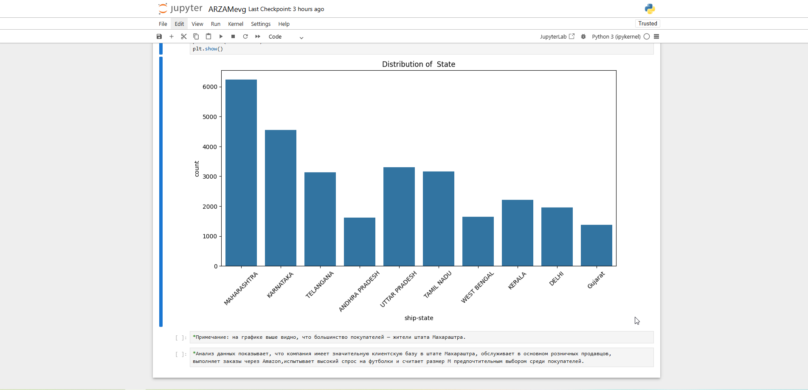

# Python Полноценный анализ данных розничных продаж в Jupyter Notebook

Самостоятельно изучила и создала  проект по анализу данных, изучив видеоурок.

Источник: Видеоурок: 📺"Data Analysis End-to-End Project for RESUME | STEP BY STEP | Python Project for Data Analyst" (https://www.youtube.com/watch?v=1TmrFEHTg54&t=491s).

✏️ Описание проекта:

Проект демонстрирует полный цикл анализа данных: от загрузки и очистки данных до их анализа и визуализации с использованием Python в среде Jupyter Notebook.

💡Технологии применяемые в проекте:

 - Python
   
 - Jupyter Notebook
   
 - Библиотеки: Pandas, NumPy, Matplotlib, Seaborn.

📊Рабочий процесс проекта:

🔹Загрузка и очистка данных: Импортировала датасет (например, данные о продажах, такие как Superstore) с помощью Pandas, провела очистку (удалила пропущенные значения, обработала аномалии).

🔹Анализ данных: Провела исследовательский анализ данных (EDA), вычислив ключевые метрики, такие как сумма продаж, средняя прибыль, и сегментацию по категориям или регионам.

🔹Визуализация: Создала информативные графики (линейные диаграммы, столбчатые диаграммы, тепловые карты) с использованием Matplotlib и Seaborn для наглядного представления результатов.

🔹Интерактивность: Использовала Jupyter Notebook для пошагового выполнения кода с пояснениями в markdown-ячейках, что упростило документирование процесса.

🔹Оптимизация: Написала структурированный код с комментариями и выводами, чтобы результаты были понятны и воспроизводимы.

Проект позволил мне углубить навыки работы с Python, включая обработку данных, статистический анализ и создание визуализаций. Результатом стал полноценный аналитический отчет в Jupyter Notebook, который можно использовать для портфолио или дальнейших исследований.

🖼️ Скриншот проекта

